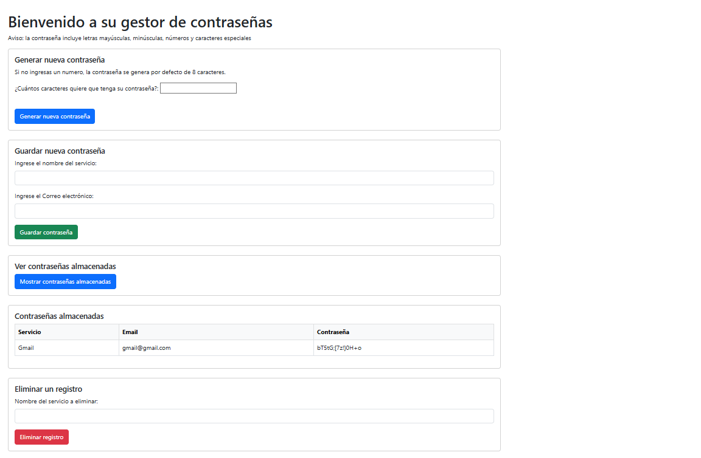

# Gestor de Contraseñas en Python

Este proyecto es una evolución del gestor de contraseñas en consola, ahora con una interfaz web construida con Flask. Conserva la lógica de seguridad, cifrado y validación del proyecto original, pero ofrece una experiencia más visual e interactiva.

🔗 Proyecto original en consola:
https://github.com/ivansimeoni/generador-contrasenas-python-SQLite

## Características

- Generación de contraseñas seguras con múltiples requisitos.
- Almacenamiento cifrado de contraseñas en una base de datos local (SQLite).
- Validación de emails con email_validator.
- Visualización y eliminación de contraseñas almacenadas.
- Interfaz web intuitiva desarrollada con Flask, Bootstrap y Jinja2.

## Cómo funciona la generación de contraseñas
Las contraseñas generadas por este gestor cumplen con criterios de seguridad para proteger tus datos:

- **Longitud mínima por defecto:** 8 caracteres
- **Contenido obligatorio:**
  - Al menos **una letra minúscula** (`a-z`)
  - Al menos **una letra mayúscula** (`A-Z`)
  - Al menos **tres números** (`0-9`)
  - Al menos **dos símbolos** (por ejemplo: `!@#$%&*`)

> El usuario puede elegir una longitud mayor al generar la contraseña.

## Requisitos

- Python 3.8 o superior
- Paquetes: `flask`, `cryptography`, `email_validator`

Instala las dependencias necesarias ejecutando:

```bash
pip install flask cryptography email_validator
```

## Instrucciones para ejecutar la aplicación web

1. Clona este repositorio en tu máquina local:
    ```bash 
    git clone https://github.com/ivansimeoni/generador-contrasenas-python-Flask
    ```
2. Accede a la carpeta del proyecto:
    ```bash
    cd generador-contrasenas-python-Flask
    ```
3. Ejecuta la aplicación Flask:
    ```bash
    python app.py
    ```
4. Abre tu navegador y entra en [http://localhost:5000](http://localhost:5000)

## Ejemplo de uso

1. Ingresa a [http://localhost:5000](http://localhost:5000) en tu navegador después de ejecutar la `app.py`.
2. Verás una interfaz con las siguientes opciones:
   - **Generar nueva contraseña:** Elige la longitud y genera una contraseña segura.
   - **Guardar nueva contraseña:** Ingresa el servicio y email.
        La contraseña se genera automáticamente por la aplicación y no puede ser personalizada en esta versión.
   - **Ver contraseñas almacenadas:** Visualiza todas las contraseñas guardadas (desencriptadas).
   - **Eliminar un registro:** Elimina una contraseña indicando el nombre del servicio.

#### Ejemplo visual de la interfaz:



- Si generas una contraseña, aparecerá en pantalla y podrás copiarla o guardarla.
- Si guardas una contraseña, recibirás un mensaje de confirmación.
- Al mostrar contraseñas, verás una tabla con los servicios, usuarios y contraseñas desencriptadas.
- Al eliminar, recibirás un mensaje de éxito o error según corresponda.

## Estructura del proyecto

El repositorio contiene los siguientes archivos:

- `app.py`: archivo principal de la aplicación web Flask.
- `utils.py`: funciones auxiliares (generación, cifrado, validación, base de datos).
- `templates/index.html`: plantilla HTML principal.
- `datos.db`: base de datos SQLite generada automáticamente (si no existe).
- `.key`: clave utilizada para cifrar y descifrar contraseñas (se genera automáticamente).

## Consideraciones de seguridad

- Las contraseñas están cifradas con `Fernet` (de la librería `cryptography`) y protegidas por una clave única generada automáticamente y almacenada en el archivo `.key`.
- La base de datos se guarda en el archivo `datos.db`.
- Se valida que el usuario sea un email válido usando la librería email_validator.
- No compartas el archivo `.key` ni `datos.db` para mantener la seguridad de tus contraseñas.

## Historial de cambios

- **v2.0 (2025-06):**  
  - Migración de la interfaz de consola a una interfaz web usando Flask y Bootstrap.
  - Mejoras en la experiencia de usuario: formularios web, mensajes de confirmación y error.
  - Visualización y eliminación de contraseñas desde la web.
  - Validación de email en el formulario.
  - Código modularizado en `utils.py` y uso de plantillas HTML dinámicas.
  

- **v1.0:**  
  - Versión inicial con interfaz de consola.
  - Generación y almacenamiento cifrado de contraseñas.
  - Validación básica de email.
  - Operaciones CRUD desde consola.

## Autor
[Iván Simeoni](https://github.com/ivansimeoni)